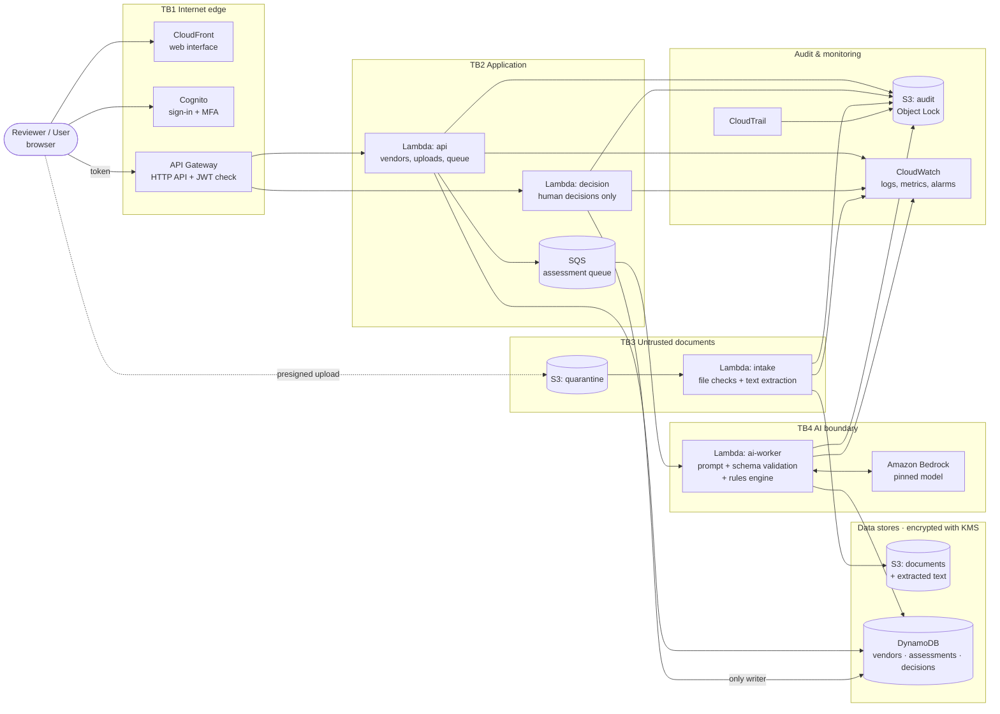
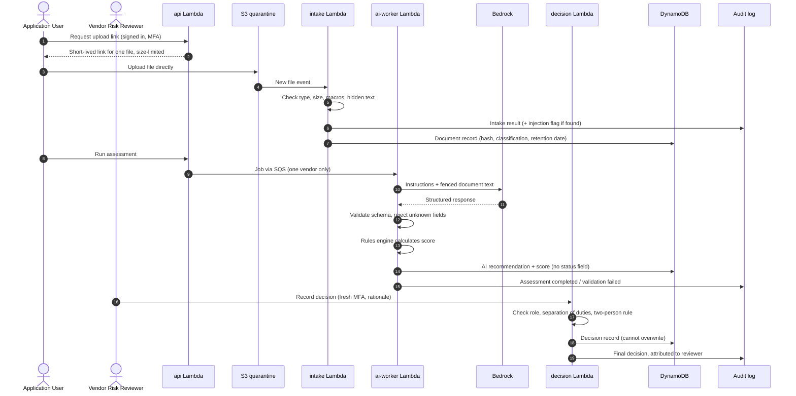
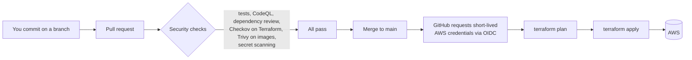

# Phase 2 Architecture

| | |
|---|---|
| **System** | Counterpart: AI-assisted vendor risk assessment |
| **Document owner** | Jasmine Alexander, ISSO |
| **Version** | 0.1 (draft) |
| **Date** | 2026-10-08 |
| **Builds on** | [Phase 1 Requirements & Security Brief](../system-security/phase-1-requirements-security-brief.md) |
| **Status** | Awaiting approval before Phase 3 (repository and pipeline) |

Nothing in this document has been deployed. It describes what we will build, why, and what it will cost.

---

## 1. Architecture at a glance

Counterpart is **serverless**: there are no servers to patch and nothing runs (or costs money) while nobody is using it. A browser loads the web interface, signs the user in, and calls an API. Small functions handle each job, and each function has its own narrowly scoped permissions.

Five design rules shape every choice below:

1. **Untrusted until checked.** Uploaded documents land in a quarantine area and are checked before anything reads them.
2. **One job, one identity.** Each function has its own IAM role, so a flaw in one can't use another's permissions.
3. **The AI can't decide.** The AI worker is denied write access to the decisions table in IAM policy, not just told not to in a prompt.
4. **Evidence is tamper-resistant.** Audit records go to write-once storage.
5. **Pay only for use.** No always-on components (load balancers, NAT gateways, containers that idle).

**Region:** US East (N. Virginia), `us-east-1`. New Bedrock models usually reach it first, and most published prices are quoted for it. Latency doesn't matter for this project.

## 2. Architecture diagram

GitHub renders this diagram automatically. Dashed boxes are trust boundaries (TB), explained in section 4.



## 3. How a document flows through the system



An indirect prompt injection is caught at steps 5 and 6 and contained at steps 10 and 12. The human-in-the-loop requirement is enforced at step 14, where the AI's record has no status field, and at steps 16 to 19, where only the decision service can record one.

## 4. Trust boundaries

A trust boundary is any place where data or requests cross from a less-trusted zone into a more-trusted one. Each one needs a check.

| ID | Boundary | What crosses it | Control at the crossing |
|---|---|---|---|
| TB1 | Internet → AWS edge | Browser requests | HTTPS only; Cognito sign-in with MFA; API Gateway rejects requests without a valid token |
| TB2 | API → application functions | Authenticated requests | Role and object-ownership checks in code on every request |
| TB3 | Uploaded file → processing | Untrusted vendor documents | Quarantine bucket; type, size, macro, and hidden-text checks; only plain text continues |
| TB4 | Application → AI model | Prompt with document text | Document text fenced and labeled as data; one vendor per call; token limits |
| TB5 | AI model → application | Model response | Strict schema validation; unknown fields rejected; failures logged and stopped |
| TB6 | AI recommendation → human decision | Advisory rating | Separate table and service; reviewer role, fresh MFA, rationale; AI explicitly denied |
| TB7 | GitHub → AWS | Infrastructure and code deployments | Short-lived OIDC credentials scoped to this repo's main branch; no stored keys |

## 5. AWS services and why each one is here

Every service answers six questions: what it does, why we need it, what risk it introduces, how we secure it, what the ISSO monitors, and what evidence proves the control works.

### 5.1 Amazon Cognito: sign-in and roles

| Question | Answer |
|---|---|
| What it does | Manages user accounts, passwords, MFA and sign-in. Issues a signed token (JWT) after sign-in. |
| Why we need it | Every request must be tied to a real, verified person with a role. |
| Risk it introduces | Account takeover; weak password or MFA settings; users added to the wrong group. |
| How we secure it | Authenticator-app MFA required for every user; strong password policy; self sign-up turned off; roles as Cognito groups (`app-user`, `reviewer`, `admin`, `isso`); short token lifetimes. |
| ISSO monitors | Failed sign-ins, MFA changes, group membership changes, new users. |
| Evidence | User pool configuration export showing MFA required; group list; sign-in logs. |

### 5.2 Amazon CloudFront and a private S3 bucket: the web interface

| Question | Answer |
|---|---|
| What it does | Delivers the web interface (HTML, CSS, JavaScript) over HTTPS. |
| Why we need it | Users need a secure web address; S3 alone can't serve HTTPS on a private bucket. |
| Risk it introduces | Content served over plain HTTP; the bucket exposed directly to the internet; tampered site files. |
| How we secure it | Bucket stays private and only CloudFront can read it (origin access control); HTTPS enforced; security headers (content security policy, no framing). |
| ISSO monitors | Changes to the bucket policy or CloudFront settings. |
| Evidence | Bucket policy; Block Public Access settings; a test showing the bucket URL refuses direct access. |

### 5.3 Amazon API Gateway (HTTP API): the front door for requests

| Question | Answer |
|---|---|
| What it does | Receives API calls from the browser and routes them to the right function. |
| Why we need it | One controlled entry point where every request is authenticated before any code runs. |
| Risk it introduces | Unauthenticated routes; request floods that drive up cost. |
| How we secure it | JWT authorizer that rejects requests without a valid Cognito token; throttling limits; CORS limited to our web address; access logging on. |
| ISSO monitors | 401 and 403 rates, throttled requests, new or changed routes. |
| Evidence | Route list showing an authorizer on every route; a test call without a token returning 401. |

### 5.4 AWS Lambda (container images) and Amazon ECR: the application code

We use four functions, each with its own IAM role:

| Function | Job |
|---|---|
| `api` | Vendor records, upload links, starting assessments, reading results |
| `intake` | Checks each uploaded file and extracts plain text |
| `ai-worker` | Builds the prompt, calls Bedrock, validates the response, runs the rules engine, stores the recommendation |
| `decision` | The only code that can record a human decision |

| Question | Answer |
|---|---|
| What it does | Runs our Python code only when needed. ECR stores the container images the functions run from. |
| Why we need it | No servers to patch and no charge while idle; containers let us scan the full software package. |
| Risk it introduces | Vulnerable code or packages; a function with too much permission; tampered images. |
| How we secure it | One role per function with least privilege; images scanned on push; images referenced by digest so a tag can't be swapped; timeouts and concurrency limits. Functions run outside a VPC to avoid NAT costs (see section 13, decision D-02). |
| ISSO monitors | Errors, throttles, image scan findings, changes to function code or roles. |
| Evidence | IAM policy per function; ECR scan results; the SBOM produced by the pipeline. |

### 5.5 Amazon SQS: the assessment queue

| Question | Answer |
|---|---|
| What it does | Holds "assess this vendor" jobs until the AI worker picks them up. |
| Why we need it | Separates the user's click from the slow AI call, and lets us cap how many assessments run at once. |
| Risk it introduces | Fake jobs added to the queue; jobs that fail repeatedly and keep costing money. |
| How we secure it | Only the `api` role can send and only `ai-worker` can receive; encrypted with our KMS key; failed jobs move to a dead-letter queue after 3 tries instead of retrying forever. |
| ISSO monitors | Dead-letter queue depth; queue age. |
| Evidence | Queue policy; dead-letter queue configuration; alarm definition. |

### 5.6 Amazon S3: document, quarantine and audit storage

| Bucket | Holds | Key settings |
|---|---|---|
| `quarantine` | Uploads before checking | Objects deleted after 1 day; only the `intake` role can read |
| `documents` | Checked files and extracted text | Versioning on; lifecycle rule enforces the retention date |
| `audit` | Application audit events and CloudTrail logs | Object Lock; no role can delete |
| `web` | The web interface files | Readable only by CloudFront |
| `tf-state` | Terraform's record of what exists | Versioning on; readable only by the deploy role and you |

| Question | Answer |
|---|---|
| What it does | Stores files. |
| Why we need it | Vendor documents and audit records need durable, encrypted storage. |
| Risk it introduces | Public exposure (the most common cloud breach); deletion of evidence. |
| How we secure it | Block Public Access on the account and every bucket; encryption with our KMS key; bucket policies that deny any request not using HTTPS; presigned upload links that expire in minutes and enforce a size limit. |
| ISSO monitors | Bucket policy changes, public access findings, unusual reads. |
| Evidence | Block Public Access settings; encryption configuration; an anonymous read test returning Access Denied. |

**About Object Lock:** it makes stored objects impossible to change or delete until a retention date. *Compliance mode* can't be overridden even by the account's root user, so a mistake can't be undone until the date passes. For this lab we use *governance mode* with 30-day retention, which administrators with a special permission can override. A production system would use compliance mode. Writing down that tradeoff is part of the deliverable.

### 5.7 AWS KMS: encryption keys

| Question | Answer |
|---|---|
| What it does | Creates and protects the key that encrypts our data at rest. |
| Why we need it | A customer managed key lets us decide exactly who can use it, and records every use in CloudTrail. |
| Risk it introduces | Someone deletes or disables the key, making data unreadable; overly broad key permissions. |
| How we secure it | Key policy grants use only to the specific roles that need it; automatic yearly rotation on; key deletion requires a waiting period. |
| ISSO monitors | Key policy changes; scheduled deletion; disable events. |
| Evidence | Key policy; rotation status; CloudTrail entries for key use. |

### 5.8 Amazon DynamoDB: the application database

| Table | Holds | Who can write |
|---|---|---|
| `vendors` | Vendor records and document metadata | `api`, `intake` |
| `assessments` | AI recommendations and rules-engine scores, versioned | `ai-worker` only |
| `decisions` | Human decisions | `decision` only |

| Question | Answer |
|---|---|
| What it does | Stores structured records. On-demand mode means no charge when idle. |
| Why we need it | Fast, serverless storage with access control per table. |
| Risk it introduces | One user reading another's records; decisions overwritten or changed. |
| How we secure it | Encryption with our KMS key; per-table IAM permissions; decisions are written with a condition that refuses to overwrite an existing record; point-in-time recovery on. |
| ISSO monitors | Writes to `decisions`; IAM changes affecting tables. |
| Evidence | Table encryption settings; the deny statement on the AI worker's role; a failed overwrite test. |

### 5.9 Amazon Bedrock: the AI model

| Question | Answer |
|---|---|
| What it does | Runs a foundation model through an API. No model servers to manage. |
| Why we need it | Reading documents and extracting findings. |
| Risk it introduces | Prompt injection; data disclosure; runaway token cost; model behavior changing between versions. |
| How we secure it | `ai-worker` may call one pinned model and nothing else; document text is fenced as data; per-assessment and monthly token caps; schema validation on every response. AWS documentation states that model providers can't access customer prompts and completions. We'll confirm the full data-use and retention terms in Phase 5. |
| ISSO monitors | Invocation count, token usage, validation failures, injection flags. |
| Evidence | The `ai-worker` IAM policy naming one model; test results; usage metrics. |

The specific model, and its per-token price, is chosen in Phase 5. Until then the app runs against a pretend model on your Mac.

### 5.10 AWS CloudTrail: a record of every AWS action

| Question | Answer |
|---|---|
| What it does | Logs every API call made in the AWS account: who, what, when, from where. |
| Why we need it | It's the evidence trail for account activity, including IAM and key changes. |
| Risk it introduces | Attackers turning it off to hide activity (MITRE ATT&CK T1562.008, Disable or Modify Cloud Logs). |
| How we secure it | One trail for all regions; log file integrity validation on; logs delivered to the Object Lock bucket; an alarm if the trail is stopped or changed. |
| ISSO monitors | Root sign-ins, IAM changes, KMS changes, trail changes. |
| Evidence | Trail configuration; a validated log digest; the alarm definition. |

### 5.11 Amazon CloudWatch: logs, metrics and alarms

| Question | Answer |
|---|---|
| What it does | Collects function logs, tracks metrics and sends alerts. |
| Why we need it | Continuous monitoring: the ISSO needs to know when something goes wrong. |
| Risk it introduces | Sensitive data written into logs; logs kept forever and growing in cost. |
| How we secure it | Logs never contain secrets, tokens or document text; log groups encrypted and kept 90 days; alarms send email through SNS. |
| ISSO monitors | The alarms in section 9. |
| Evidence | Alarm list; a sample log line showing no sensitive data; an alarm test. |

### 5.12 AWS IAM, IAM Identity Center and GitHub OIDC: who can do what

| Question | Answer |
|---|---|
| What it does | Defines every identity (people, functions, the deployment pipeline) and what each may do. |
| Why we need it | Least privilege is the foundation of every other control here. |
| Risk it introduces | Over-permissive roles; long-lived access keys that leak. |
| How we secure it | No IAM users with access keys. You sign in through IAM Identity Center with MFA. GitHub deploys through OIDC: AWS issues short-lived credentials only to workflows from your repo's main branch. Root account locked away with MFA and no keys. |
| ISSO monitors | New roles, policy changes, any access key creation, root use. |
| Evidence | Role trust policies; IAM credential report showing no access keys; Access Analyzer findings. |

### 5.13 Supporting services

| Service | Purpose | Cost |
|---|---|---|
| AWS Budgets | Email alerts at spending thresholds ($5 and $10) | Budget alerts are free (re-verify at setup) |
| SSM Parameter Store (standard) | Non-secret configuration, such as the pinned model ID and token caps | Free for standard parameters (re-verify) |
| IAM Access Analyzer | Flags any resource shared outside the account | Free for external access findings (re-verify) |
| Amazon SNS | Delivers alarm emails | Free at our volume (re-verify) |

**Why no Secrets Manager?** With Cognito for users and IAM roles for every service, the app has no passwords or API keys to store. Bedrock is called with the function's IAM role, not a key. Not needing a secret is stronger than storing one well. If a secret appears later, it goes in Secrets Manager.

## 6. IAM model

### 6.1 Machine identities

Each role can reach only the resources listed. Everything else is denied by default.

| Role | Allowed | Explicitly denied |
|---|---|---|
| `api-role` | Read and write `vendors`; read `assessments` and `decisions`; create presigned uploads to `quarantine`; send to the assessment queue; write audit events | Write `assessments` or `decisions`; call Bedrock |
| `intake-role` | Read and delete in `quarantine`; write `documents`; update document metadata in `vendors`; write audit events | Call Bedrock; touch `decisions` |
| `ai-worker-role` | Receive from the queue; read extracted text in `documents`; invoke one pinned Bedrock model; write `assessments`; write audit events | **Any write to `decisions`**; read original files; any other model |
| `decision-role` | Read `vendors` and `assessments`; write new items to `decisions` only; write audit events | Call Bedrock; change `assessments` |
| `github-deploy-role` | Create and update the project's resources through Terraform | Assumable only by GitHub OIDC tokens from this repo's `main` branch |
| CloudTrail service | Write to the `audit` bucket's CloudTrail prefix | Everything else |

No role is allowed to delete from the `audit` bucket. Every role that writes audit events can only add new objects.

### 6.2 People

| Person | How they sign in | What they can reach |
|---|---|---|
| App users (fictional reviewers, users, admin, ISSO) | Cognito, with MFA | Only the app, according to their group |
| You, as the AWS account owner | IAM Identity Center, with MFA | The AWS console, for setup, investigation and evidence collection |
| Root account | Locked away; used only for tasks that require it | Everything (which is why it's locked) |

### 6.3 Application permission checks

API Gateway proves who a user is. The function code decides what they may do, on every request:

1. **Role check:** the `cognito:groups` value in the token must include the required group.
2. **Ownership check:** an `app-user` may see only vendors they created. This blocks OWASP API1:2023, Broken Object Level Authorization.
3. **Duty check:** on decisions, the reviewer must not be the person who uploaded that vendor's documents.

Each check that fails returns 403 and writes a "permission denied" audit event.

## 7. How the human decision is protected

The rule "the AI must never approve or reject a vendor" is enforced in five independent layers. Any one of them alone would stop it; together they make a single mistake survivable.

| Layer | Control | What it stops |
|---|---|---|
| 1. Output schema | The AI's response format has no status, approval or decision field. Unknown fields are rejected. | A manipulated model response carrying a decision |
| 2. Separate data | Recommendations go to `assessments`; decisions go to `decisions`. A vendor's status is read only from `decisions`. | A recommendation being mistaken for a decision |
| 3. IAM deny | `ai-worker-role` has an explicit deny on writing `decisions`. An explicit deny overrides any allow added later by mistake. | Even buggy or compromised AI code writing a decision |
| 4. Decision service | Only the `decision` function writes decisions, and only for a signed-in `reviewer`, with fresh MFA, a rationale, the separation-of-duties check and the two-person rule for Critical vendors | An unauthorized or unaccountable person deciding |
| 5. No overwrites | Decisions are written with a condition that fails if the record already exists. A change means a new decision record, never editing the old one. | Quietly rewriting history |

**Fresh MFA before a decision:** Cognito tokens include the time the user last signed in (the `auth_time` claim). The `decision` function rejects the request if that sign-in was more than 15 minutes ago, which forces the reviewer to sign in again with MFA. We'll confirm the exact token behavior in Phase 7.

**What a decision record contains:** decision ID, vendor ID, decision, conditions (if any), rationale, reviewer's Cognito user ID, whether it was an override, the assessment version and rule set version reviewed, and a UTC timestamp. Each one also produces an audit event.

## 8. Data protection and retention

| Data | Where | Encrypted with | Retention | How it's removed |
|---|---|---|---|---|
| Uploaded files awaiting checks | `quarantine` bucket | KMS key | 1 day | Lifecycle rule deletes it |
| Checked files and extracted text | `documents` bucket | KMS key | 3 years after last assessment (proposed) | Lifecycle rule; earlier deletion by an admin request is logged |
| Vendors, assessments, decisions | DynamoDB | KMS key | Same as the vendor's documents | Deleted with the vendor; decision records kept as long as their audit events |
| Audit events and CloudTrail logs | `audit` bucket | KMS key | Object Lock 30 days in the lab; 1 year proposed for production | Lifecycle rule after retention ends |
| Function logs | CloudWatch Logs | KMS key | 90 days | Log group retention setting |

All traffic uses TLS: browser to CloudFront and API Gateway, and every call between AWS services.

**Secure deletion:** S3 and DynamoDB don't offer "overwrite with zeros." In the cloud, deletion plus encryption is the accepted approach: data is unreadable without the key, and deleting the key (after its waiting period) makes every copy, including backups, permanently unreadable. Tearing down the lab ends with scheduling the key for deletion. This is sometimes called crypto-shredding.

## 9. Logging and monitoring

### 9.1 Audit events

Every function writes structured audit events with the same fields:

| Field | Example |
|---|---|
| `event_id` | `evt_01J…` |
| `timestamp` | `2026-10-08T22:14:03Z` |
| `actor` | Cognito user ID, or the function name for system actions |
| `actor_role` | `reviewer` |
| `action` | `decision.recorded` |
| `resource` | `vendor:ven_7f3a` |
| `outcome` | `success`, `denied`, `failed`, `flagged` |
| `details` | Small, non-sensitive context, such as a rule set version |

Never logged: passwords, tokens, keys, or document contents. Documents are referenced by ID and hash only.

Each event is written twice: to CloudWatch Logs, where it drives alarms, and as a new object in the Object Lock `audit` bucket, where it serves as tamper-resistant evidence.

### 9.2 Alarms

| Alarm | Trigger | Why it matters |
|---|---|---|
| Prompt-injection flagged | Any intake event with outcome `flagged` | Indirect prompt injection attempt |
| AI validation failures | 3 or more in an hour | Model misbehavior or manipulation |
| Permission denied | 5 or more from one user in 10 minutes | Probing for access |
| Failed sign-ins | 10 or more in 10 minutes | Password guessing |
| Decision override | Any decision flagged as an override | ISSO review of risk acceptance |
| Token budget | 80% of the monthly cap | Cost abuse or a runaway loop |
| Dead-letter queue | Any message | Jobs failing repeatedly |
| CloudTrail changed | Trail stopped, deleted or modified | Attempt to hide activity |
| Root account used | Any root sign-in | Root should never be needed day to day |
| IAM or KMS policy changed | Any change outside a pipeline deployment | Possible privilege escalation |
| AWS budget | $5 and $10 per month | Cost guardrail |

The oversight-health metrics (AI agreement rate and median review time) are computed from audit events and reviewed by the ISSO weekly rather than alarmed, since they need judgment.

## 10. Deployment pipeline



- **No stored AWS keys.** GitHub proves its identity to AWS with a signed OIDC token, and AWS checks that it came from your repo's `main` branch before granting temporary credentials.
- **Checks block merges.** A failed test or a critical security finding stops the change.
- **Every change is reviewed and recorded** through pull requests, which becomes your configuration management evidence (CM-3).

Pull requests and these checks are set up in Phase 3. Deployment to AWS doesn't happen until Milestone 3.

## 11. Terraform layout

Modules are named by what they do, not by AWS service names, so an Azure version could be added beside each one later without changing the environment code.

```
infrastructure/
├── bootstrap/            # Applied once by hand: state bucket, GitHub OIDC role
├── environments/
│   └── dev/              # Calls the modules; holds dev settings and backend config
└── modules/
    ├── identity/aws/     # Cognito user pool and groups
    ├── web/aws/          # CloudFront and the web bucket
    ├── api/aws/          # API Gateway, Lambda functions, ECR, SQS
    ├── storage/aws/      # Document and quarantine buckets
    ├── data/aws/         # DynamoDB tables
    ├── ai/aws/           # Bedrock permissions and model settings
    ├── security/aws/     # KMS key, Access Analyzer
    ├── logging/aws/      # CloudTrail, audit bucket, log groups
    └── monitoring/aws/   # Alarms, SNS, budgets
```

Terraform keeps its state, its record of what it created, in the `tf-state` bucket. The state file can contain sensitive details, so the bucket is private, encrypted and versioned. Recent Terraform versions can lock state using S3 alone, so no extra DynamoDB lock table is needed (we'll confirm the version in Phase 3).

## 12. Cost estimate

Prices are for US East (N. Virginia), checked 2026-10-08 against AWS pricing pages. Items marked "re-verify" will be checked again before anything is deployed.

### 12.1 While idle (no one using the app)

| Item | Monthly cost | Basis |
|---|---|---|
| KMS customer managed key | $1.00 | $1 per key per month; first 20,000 requests free |
| ECR image storage (about 1 GB) | About $0.10 | $0.10 per GB-month; 500 MB free for the first year on new accounts |
| S3 storage (a few MB of synthetic documents and logs) | Under $0.05 | re-verify |
| DynamoDB on-demand storage | Pennies | re-verify |
| CloudTrail (one trail, management events) | $0 | First copy of management events delivered to S3 is free |
| Cognito (a handful of users) | $0 | 10,000 monthly active users free; doesn't expire |
| Lambda, API Gateway, SQS, CloudWatch | $0 | No charge without traffic |
| **Estimated total while idle** | **About $1.25** | |

### 12.2 When you use it

| Item | Cost | Basis |
|---|---|---|
| Lambda | $0 at our volume | 1 million requests and 400,000 GB-seconds per month free; then $0.20 per million requests |
| API Gateway HTTP API | $0 for the first year, then $1.00 per million requests | 1 million calls per month free for 12 months for new customers |
| Bedrock model tokens | Depends on the model chosen in Phase 5 | Capped per assessment and per month; budget alarm |

At a few dozen test assessments a month, everything except Bedrock stays at or near zero. Budget alarms at **$5** and **$10** give warning well before the Phase 1 target of under $10 per month.

### 12.3 Where surprise charges come from, and how we avoid them

| Component | Typical cost if left running | How we avoid it |
|---|---|---|
| NAT gateway | About $33 per month plus $0.045 per GB | Lambda runs outside a VPC (decision D-02) |
| Interface VPC endpoints | About $7.30 per month each, per availability zone | Not needed without a VPC |
| Public IPv4 addresses | About $3.65 per month each | No servers or load balancers |
| Application Load Balancer and ECS Fargate | Hourly charges even when idle (re-verify) | Lambda instead (decision D-01) |
| Bedrock in a retry loop | Unbounded | Dead-letter queue after 3 tries; token caps; budget alarm |
| CloudWatch logs kept forever | Grows every month | 90-day retention |
| KMS requests from S3 | A charge on every encrypted read and write | S3 Bucket Keys turned on, which cuts KMS calls |
| Optional security services (GuardDuty, Security Hub, AWS Config) | Ongoing charges after any free trial | Not always on; may be enabled briefly to capture evidence (decision D-09) |

### 12.4 Choosing an AWS account plan

New AWS accounts now choose between two plans. Both include up to $200 in credits ($100 at sign-up and up to $100 more for exploring services).

| | Free plan | Paid plan |
|---|---|---|
| Services | Limited to select services | All services |
| Charges | None unless you upgrade | Pay as you go once credits are used |
| Duration | The account closes after 6 months or when credits run out, whichever comes first | Ongoing |

**Recommendation: the paid plan, with budget alarms set on day one.** A portfolio has to stay online while you're job hunting, which may be longer than 6 months, and the free plan may not include Bedrock. Your credits still apply on the paid plan, and with this design they should cover months of use.

The project's AWS account was created on 2026-10-08. Which plan it is on, and whether that plan includes Bedrock, is checked during Phase 0.

## 13. Design decisions and accepted risks

| ID | Decision | Alternative considered | Tradeoff or accepted risk |
|---|---|---|---|
| D-01 | Lambda with container images | ECS on Fargate with a load balancer | Lambda has a 15-minute limit per run, which is plenty for one assessment. Fargate is documented as the production path. |
| D-02 | Lambda functions run outside a VPC | Functions in private subnets with a NAT gateway or VPC endpoints | **Accepted risk:** functions can reach the internet, so compromised code could send data out. Compensating controls: least-privilege roles, no secrets to steal, dependency and image scanning, synthetic data only. Logged in the POA&M with "add VPC and egress controls before any real data." |
| D-03 | No Secrets Manager | Store an API key there | There are no secrets to store, because every service uses IAM roles. |
| D-04 | Text extraction in our own code | Amazon Textract | Cheaper, and documents never leave our boundary for extraction. Scanned, image-only PDFs aren't supported and are rejected at intake with a clear message. |
| D-05 | Object Lock in governance mode, 30 days | Compliance mode, 1 year | Lets the lab be torn down. Production would use compliance mode. |
| D-06 | One KMS key for all lab data | Separate keys for documents, data and logs | Simpler and $1 instead of about $3 per month. Production would separate keys so one key policy mistake can't expose everything. |
| D-07 | No malware scanning of uploads | Amazon GuardDuty Malware Protection for S3 | Already accepted in Phase 1: synthetic data only. Logged in the POA&M. |
| D-08 | No web application firewall (AWS WAF) | WAF in front of CloudFront and the API | Saves a monthly charge. Compensating controls: authentication on every route, API throttling, strict input validation. A production system would add WAF. |
| D-09 | GuardDuty, Security Hub and AWS Config not always on | Run them continuously | They cost money monthly. If free trials are available, we can turn them on for a short window to capture findings as evidence, then turn them off. |
| D-10 | Single region, no high availability | Multi-region | Matches the Phase 1 assumption. Point-in-time recovery and versioning cover accidental deletion. |

These decisions feed directly into the Phase 10 risk register and POA&M.

## 14. Items to verify before or during later phases

| Item | When |
|---|---|
| Which Bedrock model, its per-token price, and AWS's data-use and retention terms for it | Phase 5 |
| Which plan the AWS account is on, and whether it includes Bedrock | Phase 0 (account setup) |
| Cognito `auth_time` behavior for the fresh-MFA check | Phase 7 |
| Terraform version for S3-only state locking | Phase 3 |
| Free status of AWS Budgets alerts, SSM standard parameters, IAM Access Analyzer external findings, SNS email, ECR basic scanning and CloudFront at our volume | Before first deployment |
| MITRE ATLAS and ATT&CK technique IDs used in the threat model | Phase 10 |

## 15. What comes next

The AWS account already exists, so its baseline security (Phase 0: root MFA, no root access keys, an IAM Identity Center user, budget alarms and CloudTrail) is done next. An account that exists but isn't secured is a risk even with nothing deployed in it. Phase 3 then builds the repository structure, the security pipeline in GitHub Actions, and the synthetic vendor documents, all without deploying anything to AWS.

## 16. Approval

| Role | Name | Decision | Date |
|---|---|---|---|
| ISSO / document owner | Jasmine Alexander | Pending | |
